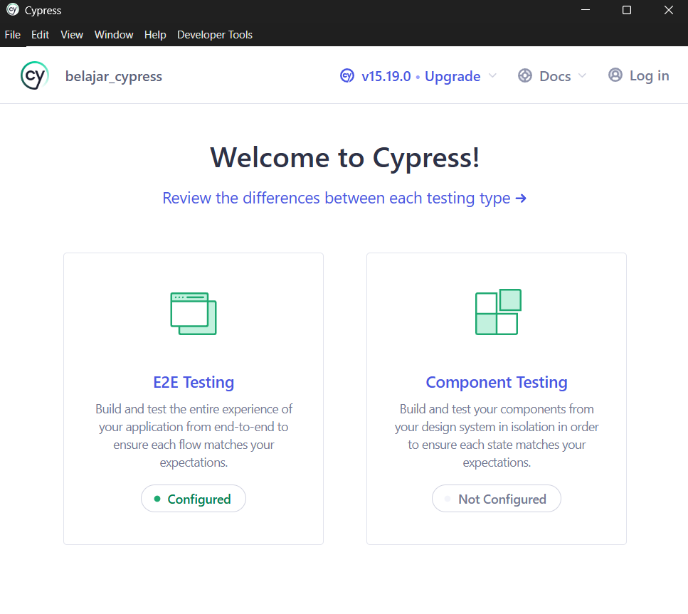
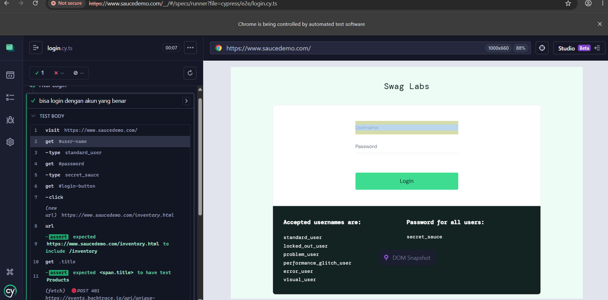
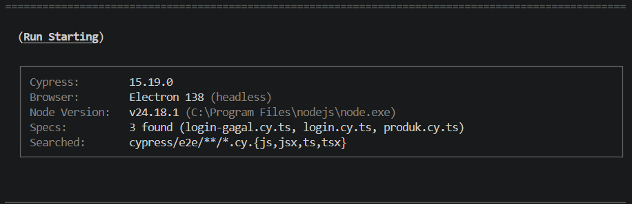
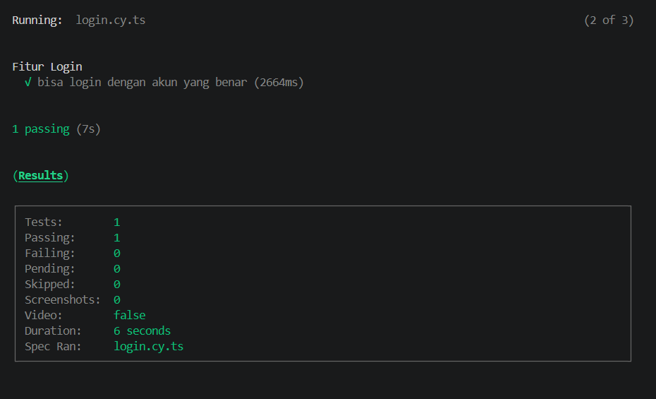
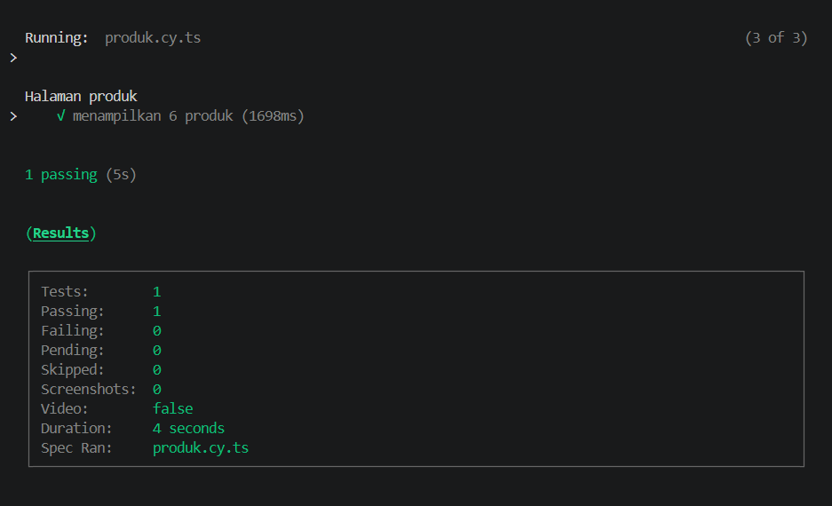
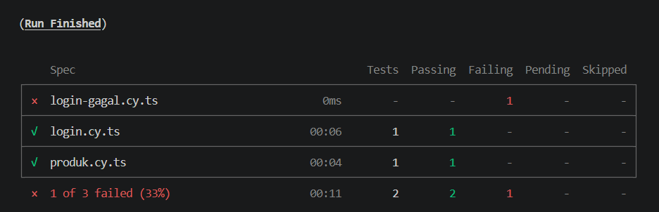

# QA Automation Engineering with Cypress + TypeScript

A hands-on project demonstrating end-to-end web automation testing built with **Cypress** and **TypeScript**. It covers the full workflow a QA/SDET role requires in practice — from environment setup and writing test specs, to running suites via CLI and interpreting results — using a real e-commerce demo application as the target under test.

This repo is designed to showcase practical automation testing skills: structuring test suites, writing readable and maintainable test cases, using proper selectors and assertions, and validating both happy-path and negative scenarios.

## Table of Contents

- [About This Repo](#about-this-repo)
- [What This Project Covers](#what-this-project-covers)
- [Tools Used](#tools-used)
- [Folder Structure](#folder-structure)
- [Running the Project](#running-the-project)
- [Example Tests](#example-tests)
- [Common Cypress Commands](#common-cypress-commands)

## About This Repo

QA (Quality Assurance), in short, is the process of maintaining product quality from the start of development through release — not just a single check right before launch. One way to test this is through **automation testing**: writing scripts that run test scenarios automatically and repeatedly, without needing to click through everything manually every time the code changes.

Automation works best for flows that are repeated often and have predictable outcomes, such as login, checkout, or regression testing. For things that are more subjective, like UI appearance or exploratory testing, manual testing still works better.

## What This Project Covers

- QA fundamentals: testing responsibilities, test types, and where automation fits in
- When automation testing adds the most value vs. when manual testing is more appropriate
- TypeScript fundamentals applied to Cypress test scripting
- Full local environment setup: VS Code, Node.js, Cypress, TypeScript
- Cypress project architecture and execution modes (interactive & headless/CI)
- Translating manual test steps into automated test code
- Selector strategy and locating elements reliably
- Writing assertions that make test intent clear
- A working case study against [saucedemo.com](https://www.saucedemo.com/), a public demo e-commerce site

## Tools Used

| Tool | Purpose |
|---|---|
| [VS Code](https://code.visualstudio.com) | Code editor for writing tests |
| [Node.js](https://nodejs.org) | Runs JavaScript/TypeScript outside the browser (required before installing Cypress) |
| [Cypress](https://www.cypress.io) | Automation testing tool for web applications |
| [TypeScript](https://www.typescriptlang.org) | Language used to write test scripts, a "stricter" version of JavaScript |

## Folder Structure

```
belajar-cypress/
├── cypress/
│   ├── e2e/            # all test files (*.cy.ts) live here
│   ├── fixtures/       # supporting data/files for tests
│   └── support/
│       ├── commands.ts # custom commands
│       └── e2e.ts      # initial configuration
├── node_modules/       # dependencies, do not edit manually
├── cypress.config.ts   # main Cypress configuration
├── tsconfig.json       # TypeScript configuration
└── package.json        # project dependency list
```

## Running the Project

1. Clone this repo, then install dependencies:
   ```bash
   npm install
   ```

2. If the Cypress binary wasn't downloaded automatically, run:
   ```bash
   npx cypress install
   ```

3. Open Cypress in interactive mode (browser window visible, auto re-runs on file save):
   ```bash
   npx cypress open
   ```

4. Or run all tests from the terminal only (useful for CI/regression):
   ```bash
   npx cypress run
   ```

## Example Tests
 
The case study in this repo uses [SauceDemo](https://www.saucedemo.com/), a demo e-commerce site made specifically for practicing automation testing.
 
**1. `login.cy.ts`**
 
```typescript
describe('Login Feature', () => {
  it('can log in with a valid account', () => {
    cy.visit('https://www.saucedemo.com/')
 
    cy.get('#user-name').type('standard_user')
    cy.get('#password').type('secret_sauce')
    cy.get('#login-button').click()
 
    // Assert
    cy.url().should('include', '/inventory')
    cy.get('.title').should('have.text', 'Products')
  })
})
```
 
Demo account used: `standard_user` / `secret_sauce`.
 
**2. `produk.cy.ts`**
 
```typescript
describe('Product Page', () => {
  beforeEach(() => {              // runs
    cy.visit('https://www.saucedemo.com/')  // before each test
    cy.get('#user-name').type('standard_user')
    cy.get('#password').type('secret_sauce')
    cy.get('#login-button').click()
  })
 
  it('displays 6 products', () => {
    cy.get('.inventory_item').should('have.length', 6)
  })
})
```

## Common Cypress Commands

| Command | Function |
|---|---|
| `cy.visit('url')` | Open a web page |
| `cy.get('selector')` | Get an element on the page |
| `cy.contains('text')` | Find an element by its visible text |
| `.type('text')` | Type into an input field |
| `.click()` | Click an element |
| `.clear()` | Clear an input field |
| `.select('option')` | Select a dropdown option |
| `.check()` | Check a checkbox or radio button |
| `.should(...)` | Assertion — checks the result |

## Screenshots

**Cypress Launchpad (interactive mode)**



**`login.cy.ts` passing in the Cypress runner**



**`npx cypress run` starting from the terminal**



**Test steps for `login.cy.ts` in the runner sidebar**



**`produk.cy.ts` passing via terminal run**



**Final summary after running all specs (`npx cypress run`)**



---

## References
 
- [Cypress Documentation](https://docs.cypress.io)
- [TypeScript Documentation](https://www.typescriptlang.org/docs)
- [Node.js Documentation](https://nodejs.org/en/docs)
- [SauceDemo](https://www.saucedemo.com/) — demo application used for the test scenarios
---

Built as a practical demonstration of QA Automation Testing skills using Cypress + TypeScript.
